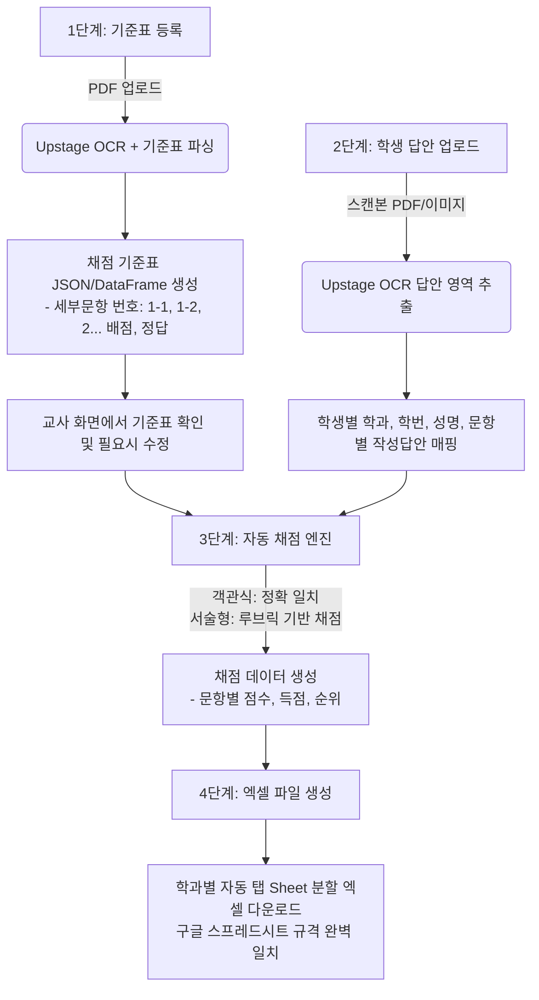

# 📋 Upstage OCR 기반 자동 채점 및 통계 리포트 시스템 구축 계획안

본 계획안은 교사가 **[문제지/정답지/배점기준 PDF]**와 **[학생 답안지 스캔 파일]**을 업로드하면, **Upstage Document AI/OCR API**와 **파이썬(Streamlit + Pandas + OpenPyXL)**을 통해 학생 답안을 자동 추출하고 채점한 뒤, 교사가 요청한 **구글 스프레드시트 양식(학과별 자동 시트 분할)**과 100% 일치하는 엑셀 파일을 산출하는 시스템 구축 계획입니다.

---

## 1. 시스템 핵심 아키텍처 및 기술 스택

가장 **간편하고(설치 및 UI 단순화)**, **경제적(불필요한 API 낭비 방지)**인 구성을 지향합니다.

| 구분 | 선정 기술 | 선정 이유 및 특징 |
| :--- | :--- | :--- |
| **개발 언어** | **Python 3.10+** | 데이터 처리(Pandas), OCR 연동, 엑셀 수식 자동화에 최적 |
| **사용자 인터페이스** | **Streamlit** | 순수 파이썬으로 직관적인 교사용 웹 대시보드 구축 (파일 업로드, 기준표 확인/수정, 엑셀 다운로드) |
| **OCR 엔진** | **Upstage Document Parse / OCR API** | 한국어 인쇄체 및 수기 필기체 인식률 우수, 표/답안란 인식 지원 |
| **채점 및 기준표 파싱** | **Upstage Solar LLM** | Upstage API 키 하나로 OCR과 채점(서술형/부분점수 판단)을 일원화하여 경제적 운용 |
| **데이터 및 엑셀 생성** | **OpenPyXL & Pandas** | 구글 스프레드시트와 동일한 3행 헤더 구조, 학과별 시트 자동 추가, SUM/RANK 수식 자동 삽입 |

---

## 2. 전체 작업 처리 절차 (4단계 파이프라인)

### [1단계] 채점 기준표 및 템플릿 생성 (동적 재파싱 지원)
1. **새로운 시험 등록 및 파일 업로드**: 교사가 매 시험마다 새로운 문제지, 답안지, 배점 기준표 PDF를 업로드합니다.
2. **동적 AI 재파싱 (Dynamic Re-parsing)**: 
   - 고정된 규격이 아닌 **"업로드된 새 문서에 맞춰 매번 완전히 새롭게 파싱"**합니다.
   - 문항 개수, 소문항 체계(`1-1, 1-2, 2...`), 배점, 유형(객관식/단답형/서술형)을 새로 판독하여 새 채점 기준표를 즉시 재구축합니다.
   - 새로운 시험을 진행할 때 언제든 **[새 기준표 파싱 / 재설정]** 버튼을 통해 이전 데이터를 초기화하고 새 규격으로 전환할 수 있습니다.
3. **교사 검토 및 실시간 수정 UI**: 화면에 동적으로 생성된 표(문항별 배점, 정답, 키워드)를 교사가 직접 행/열 단위로 추가, 삭제, 수정할 수 있습니다.

### [2단계] 학생 답안지 스캔본 인식 및 구조화
1. **스캔 파일 일괄 업로드**: 학생 답안지(낱장 이미지 zip 또는 다중 페이지 PDF)를 업로드합니다.
2. **OCR 필기 인식**: Upstage OCR을 통해 상단의 **[학과, 학번, 성명]**과 각 문항별 **[학생 기입 답안]**을 정밀하게 추출합니다.
3. **학과별 그룹핑**: 추출된 학생들을 학과별로 자동 분류하여 재배치합니다.

### [3단계] 채점 엔진 구동
- **객관식/단답형**: 정답과 대조하여 자동 일치 검사 (`정답`: 배점 부여, `오답`: 0점)
- **서술형/서술단답**: 핵심 키워드 포함 여부 및 채점 기준에 따라 `부분정답` 판정 및 부분점수 부여
- 문항별 득점 산출

---

## 3. 채점 결과표 엑셀 서식 및 시트 구조 (구글 스프레드시트 맞춤형)

공유해주신 구글 스프레드시트 양식(`https://docs.google.com/spreadsheets/d/1Fw2ab5CYsdPGuynlqZoLZHsB-5YruaQTEubj3PHbeR8`)의 규격을 100% 동일하게 반영합니다.

### 3.1. 학과별 자동 시트(Sheet) 분할 생성
- 학생 답안지 상단 OCR 판독 또는 파일 그룹별 **학과명(예: 기계과, 전자과, 소프트웨어과 등)**을 기준으로, 엑셀 파일 내에 **해당 학과명의 탭(Sheet)이 자동으로 분리 및 생성**됩니다.
- 한 파일 안에서 시트 탭만 전환하여 학과별 성적을 한눈에 관리할 수 있습니다.

### 3.2. 시트 내부 레이아웃 규격 (열 및 행 배치)

| 행 번호 | A열 | B열 | C열 ~ (문항열들) | ... | 끝-1열 | 끝열 |
| :--- | :---: | :---: | :---: | :---: | :---: | :---: |
| **1행** | *(공란)* | **문항** | **1-1** \| **1-2** \| **2** \| **3** ... | ... | **득점** | **순위** |
| **2행** | *(공란)* | **정답** | *(문항별 기준 정답 / 배점)* | ... | *(총배점)* | *(공란)* |
| **3행** | **학번** | **성명** | *(각 문항 영역)* | ... | *(수식 영역)* | *(수식 영역)* |
| **4행~** | 2024001 | 김철수 | 학생 문항별 점수 (또는 정답) | ... | `=SUM(C4:AG4)` | `=RANK(AH4, AH$4:AH$30)` |
| **5행** | 2024002 | 이영희 | ... | ... | ... | ... |

- **세부 문항 체계 완벽 지원**: `1-1, 1-2, 6-1, 6-2` 등 대문항 내 소문항 번호 체계를 그대로 수용
- **자동 수식 연동**:
  - `득점`: 학생의 문항별 취득 점수 합계 (`=SUM(...)` 수식 적용)
  - `순위`: 학과 시트 내 학생들의 석차 (`=RANK(...)` 수식 자동 적용)
- **상세 데이터 시트 (옵션 제공)**:
  - 교사의 선호에 따라, 점수만 표기된 메인 성적표 외에 **[학생이 쓴 원본 답안 + 정오표(O/△/X)]**가 포함된 상세 시트도 함께 열람 가능하도록 구성

---

## 4. 학생 답안지에서의 학과 인식 및 처리 방식

1. **답안지 OCR 자동 판독**:
   - 학생 답안지 상단의 기본 정보 영역(`학과`, `학번`, `성명`)을 Upstage OCR로 자동 판독
   - 예: `학과: 기계설계과` -> `기계설계과` 시트로 자동 라우팅
2. **미인식 시 예외 처리**:
   - 답안지에 학과 표기가 없거나 오인식된 경우 교사가 웹 화면에서 일괄 선택(드롭다운)하여 지정 가능

---

## 5. 경제적/효율적 구현 전략 (비용 및 복잡도 최소화)

1. **단일 API Provider 활용 (Upstage)**
   - Upstage Document Parse / OCR API와 Solar LLM을 함께 사용하여 단 하나의 API Key로 [기준표 파싱 + 학생 손글씨 OCR + 서술형 채점]을 모두 해결합니다.
2. **API 호출 최적화 및 동적 갱신**
   - 새로운 시험 문서가 업로드되면 즉시 새 양식으로 재파싱하고 세션을 갱신합니다.
   - 파싱 완료된 기준표는 해당 시험 채점 동안만 유지되어 중복 호출을 막고 비용을 절약합니다.
   - 학생 답안지는 필요한 항목(학과/학번/성명 및 문항별 필기 영역) 위주로 경제적으로 추출합니다.
3. **간편한 실행 환경**
   - `pip install streamlit upstage openpyxl pandas python-dotenv`
   - 로컬 웹 UI(Streamlit)로 별도의 서버 호스팅 비용 없이 즉시 구동

---

## 6. 단계별 개발 진행 일정

1. **Step 1: 환경 세팅 및 프로젝트 기반 구축**
   - 의존성 패키지 정의 (`requirements.txt`), 환경변수(.env) 설정
2. **Step 2: 기준표 파서 모듈 구현 (`criteria_parser.py`)**
   - 문제/정답/배점 PDF 분석 -> 소문항(`1-1`, `1-2` 등) 인식 및 정답/배점 매핑
3. **Step 3: 학생 답안 OCR 및 채점 엔진 구현 (`ocr_grader.py`)**
   - 학과, 학번, 성명 및 문항별 학생 답안 OCR 추출 및 채점
4. **Step 4: 학과별 자동 시트 분할 엑셀 리포트 생성기 구현 (`report_generator.py`)**
   - 구글 스프레드시트와 100% 동일한 3행 헤더 구조 및 학과명 탭 자동 생성, SUM/RANK 수식 자동 입력
5. **Step 5: 교사용 Streamlit 웹 인터페이스 통합 (`app.py`)**
   - 파일 업로드 -> 채점 진행률 표시 -> 학과별 미리보기 및 엑셀 다운로드
